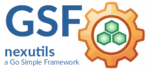

<sup>🌍 **Language:** 🇬🇧 [Englisch →](README.md)</sup>

---
|[](./LICENSE)| |
|----|----|
|| ***GSF-nexutils***<br>Modulare, wiederverwendbare Utilities für Applikationen, Services, Prozess-Engines und verteilte Systeme|

<sup>***GSF*** steht für ***Go Small Frameworks*** — minimalistische Tools für robuste Applicationen.</sup>

---

### Repository

Das Projekt wird auf Codeberg entwickelt und gewartet.

**Canonical repository:**

> https://codeberg.org/tiny-frameworks/nexutils

GitHub ist ein automatisierter Mirror des Codeberg Repositories

**GitHub mirror:**

> https://github.com/tiny-frameworks/nexutils

---

## GSF-nexutils

GSF-nexutils ist eine Sammlung kleiner, spezialisierter und wiederverwendbarer Go-Komponenten für Applikationen, Services, Prozess-Engines und verteilte Systeme.
Das Projekt stellt gängige Bausteine ​​für Fehlerbehandlung, Synchronisierung, In-Memory-Caching, strukturiertes Logging und die dazugehörige Infrastruktur bereit.

---

## Modulübersicht

| Modul | Unterpaket-Pfad | Beschreibung |
| --- | --- | --- |
| **`cache`** | `nexutils/cache` | Thread-sicherer LRU-Cache mit TTL, Hintergrund-Cleanup und JSON-Persistenz. |
| **`errors`** | `nexutils/errors` | Domain-driven Fehlerbehandlung mit Fehlercodes, Call-Paths und OS Exit-Code Mapping. |
| **`lockingwriter`** | `nexutils/lockingwriter` | Prozess-sicherer `io.Writer` mittels `.LOCK`-Dateien inklusive PID & Timestamp-Erkennung verwaister Locks. |
| **`logging`** | `nexutils/logging` | `slog`-basierter strukturierter Logger mit nativer Unterstützung für `nexutils/errors`. |
| **`p2p`** | `nexutils/p2p` | `nexutils/p2p` ist ein leichtgewichtiges, performantes JSON-RPC 2.0 über WebSocket Paket für Go. |

---

## Design-Prinzipien

1. **Zero External Dependencies:** Stützt sich rein auf die Go-Standardbibliothek (`sync`, `time`, `os`, `log/slog`, `errors`).
2. **Modulare Architektur:** Jedes Unterpaket kann unabhängig importiert werden, ohne unnötigen Code in dein Binary zu ziehen.
3. **Fail-Fast & Self-Healing:** Integrierte Schutzmechanismen wie die Wiederherstellung verwaister Locks (Stale-Lock-Recovery), begrenzte LRU-Speicherkapazitäten und typsichere Fehlerketten.
4. **Developer Experience:** Erstklassige Unterstützung für Go-`Example`-Tests und klare API-Signaturen.

---

## Installation

Importiere nur die Module, die du in deinem Go-Code benötigst:

```bash
go get codeberg.org/tiny-frameworks/nexutils

```

```go
import (
    "codeberg.org/tiny-frameworks/nexutils/cache"
    "codeberg.org/tiny-frameworks/nexutils/errors"
    "codeberg.org/tiny-frameworks/nexutils/lockwriter"
    "codeberg.org/tiny-frameworks/nexutils/logging"
    "codeberg.org/tiny-frameworks/nexutils/p2p/rpc"
)

```

---

## Projektstruktur

```text
nexutils/
├── cache/            # LRU-Cache mit TTL & JSON-Speicherung
├── errors/           # Domain-Fehlercodes & Exit-Code Mapping
├── lockwriter/       # Thread- & prozess-sicherer Datei-Writer
├── logging/          # Strukturierter JSON/Text-Logger
├── p2p/              # leichtgewichtiges, performantes JSON-RPC 2.0 über WebSocket Peer Paket
├── go.mod
├── LICENSE
└── README.md

```

---

## Tests ausführen

Führe die Unit-Tests über alle Utility-Module hinweg gleichzeitig aus:

```bash
go test -v ./...

```

---

## Organisation & Standards

* **Copyright:** © 2026 Georg Hagn.
* **Repository:** `codeberg.org/tiny-frameworks/nexutils`
* **Lizenz:** Apache License, Version 2.0.

*GSF-nexutils ist ein unabhängiges Open-Source-Projekt und steht in keiner Verbindung zu Unternehmen mit ähnlichem Namen.*

---

## Kontakt & Support

Für Anfragen, architektonische Diskussionen oder Sicherheitsfragen wende dich bitte an:

📧 **georghagn [at] tiny-frameworks.io**

---

